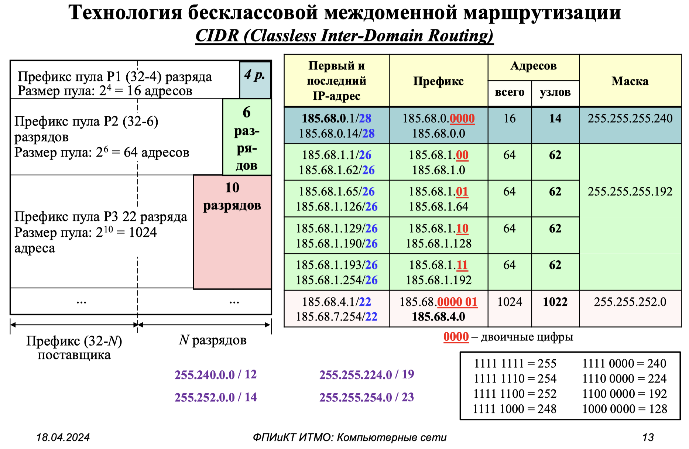

# 11. Маски, сети, подсети, шлюзы, классы сетей

## Маски

```{glossary}
Маска подсети (Subnet Mask)
    Маска подсети определяет, какая часть IP-адреса относится к сети, а какая — к хосту (устройству). Она используется для разделения IP-адреса на две части:
    - **Сеть**: идентифицирует сеть, к которой принадлежит устройство.
    - **Хост**: идентифицирует конкретное устройство в этой сети.
```

Маска подсети записывается в формате, аналогичном IP-адресу (например, 255.255.255.0). В бинарном виде 1 обозначает часть сети, а 0 — часть хоста.

Пример:
- IP-адрес: 192.168.1.10
- Маска подсети: 255.255.255.0
- Сеть: 192.168.1.0
- Хост: 10

```{dropdown} Алиев, 2024, раздел 2, стр. 12
```{figure} ../images/aliev-ip-mask.png
:name:aliev-ip-mask
Классовая адресация {cite}`алиев2024сети2`
```

## CIDR (Classless Inter-Domain Routing)
```{glossary}
CIDR
    это современный метод обозначения сетей, который позволяет гибко разделять IP-адреса без привязки к классам. Он использует нотацию `/X`, где `X` — количество бит, отведенных под сетевую часть.
```

```{dropdown} Алиев, 2024, раздел 2, стр. 13, 15

```{figure} ../images/aliev-cidr-2.png
:name:aliev-cidr-2
Технология бесклассовой междоменной маршрутизации CIDR {cite}`алиев2024сети2`
```

## Сети (Networks)

```{glossary}
Компьютерная сеть
    это группа устройств, соединенных друг с другом для обмена данными. Каждая сеть имеет уникальный идентификатор (сетевую часть IP-адреса).
```

## Подсети (Subnets)

```{glossary}
Подсеть
    это часть более крупной сети, которая может быть физически или логически отделена от других частей сети. Для определения подсетей используется маска подсети.
```

Пример:

- Исходная сеть: `192.168.1.0/24` (256 адресов).
- Разделение на подсети: `192.168.1.0/26`, `192.168.1.64/26`, `192.168.1.128/26`, `192.168.1.192/26` (по 64 адреса в каждой подсети).

## Шлюз (Gateway)
```{glossary}
Шлюз
    это устройство (обычно маршрутизатор), которое соединяет разные сети и позволяет устройствам из одной сети взаимодействовать с устройствами из другой сети. 
```

## Классы сетей (Network Classes)

Первоначально в Интернете была принята так называемая классовая адресация. Все IP-адреса разделены на 5 классов (от А до Е).

- **Класс A:** Диапазон 1.0.0.0 до 126.0.0.0. Маска по умолчанию: 255.0.0.0 (/8). Используется для крупных сетей.
- **Класс B:** Диапазон 128.0.0.0 до 191.255.0.0. Маска по умолчанию: 255.255.0.0 (/16). Для сетей среднего размера.
- **Класс C:** Диапазон 192.0.0.0 до 223.255.255.0. Маска по умолчанию: 255.255.255.0 (/24). Для небольших сетей.
- **Класс D:** Диапазон 224.0.0.0 до 239.255.255.255. Используется для multicast (групповая рассылка).
- **Класс E:** Диапазон 240.0.0.0 до 255.255.255.255. Зарезервирован.

```{dropdown} Алиев, 2024, раздел 2, стр. 11
```{figure} ../images/aliev-class-addr.png
:name:aliev-class-addr
Классовая адресация {cite}`алиев2024сети2`
```

```{bibliography}
:style: unsrt
:filter: docname in docnames
```
