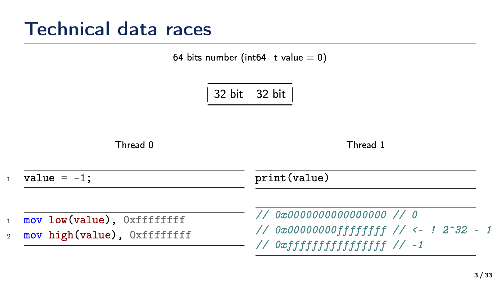

# 12. Виды гонок данных как ошибок многопоточного программирования и их отличия

```{glossary}
Гонки данных (data races)
    ситуация, когда несколько потоков одновременно обращаются к одной и той же области памяти, и хотя бы один из потоков выполняет операцию записи без надлежащей синхронизации.
```

---

### Технические гонки данных (Technical Data Races)

**Ключевая идея**: возникают, когда несколько потоков одновременно обращаются к одной и той же области памяти без использования каких-либо механизмов синхронизации (например, без мьютекса, критической секции, атомарных операций, барьеров памяти и т. д.), и при этом хотя бы один поток ведёт запись в эту область.

#### Признаки технических гонок

- Происходят на уровне «чтение/запись» одной и той же переменной или структуры данных из разных потоков.
- К ним приводит отсутствие синхронизации или неправильное её использование (несогласованность действий по блокировкам, неправильный порядок acquire/release и т.п.).
- Итоговое состояние может меняться «на лету» из-за непредсказуемого чередования инструкций в машинном коде или особенностей оптимизаций компилятора и процессора

#### Пример

```C
int sharedCounter = 0;

void increment() {
    // Предположим, что вызывается из разных потоков
    sharedCounter++; // Компилятор может разложить это на чтение + инкремент + запись
}
```

Без какой-либо синхронизации возможна ситуация, когда два потока одновременно считают значение `sharedCounter` и потом каждый по отдельности записывает обратно «старое значение + 1», в результате чего рост счётчика может идти не на +2, а всего на +1 за два потока.

#### Обнаружение

Может быть выявлено с помощью инструментов анализа, таких как `ThreadSanitizer`, `Valgrind` или статических анализаторов кода.

---

### Логические гонки данных (Logical Data Races)

**Ключевая идея**: возникают, когда порядок выполнения (или момент времени, когда происходит доступ) влияет на логическую корректность работы программы, даже если с точки зрения «чтения/записи памяти» всё может быть защищено синхронизацией. Это ошибка на уровне проектирования, а не на уровне синхронизации.

#### Признаки логических гонок

- Нет прямой «физической» проблемы параллельных записей в одно место без блокировок — все обращения могут быть корректно синхронизированы.
- Ошибка заключается в том, что из-за неправильного проектирования потоки получают или обрабатывают данные в «логически неверной» последовательности.
- Проблема может заключаться в том, как организованы зависимости между данными и между потоками (например, один поток начинает использовать данные до того, как другой завершил их обновление, хотя формально блокировки могут быть расставлены «правильно»).

#### Пример

```C
bool ready = false;
int data = 0;

void producer() {
    data = 42; // Запись данных
    ready = true; // Установка флага
}

void consumer() {
    if (ready) {
        std::cout << data; // Чтение данных
    }
}
```

В этом примере, если поток consumer выполнится до того, как producer установит `ready = true`, программа может вывести неправильное значение или вообще не вывести ничего.

#### Обнаружение

Сложнее выявить, так как это ошибка проектирования. Требуется тщательное тестирование и анализ логики программы.

```{dropdown} Доронин, 2023, раздел 2


```{figure} ../images/02_mtx/page-4.png
:name:doronin-logical-data-race
Виды гонок данных как ошибок многопоточного программирования {cite}`доронин2023-2`
```

```{bibliography}
:style: unsrt
:filter: docname in docnames
```
