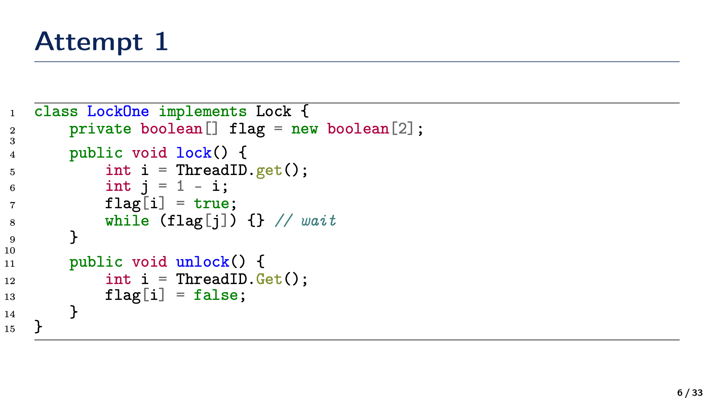
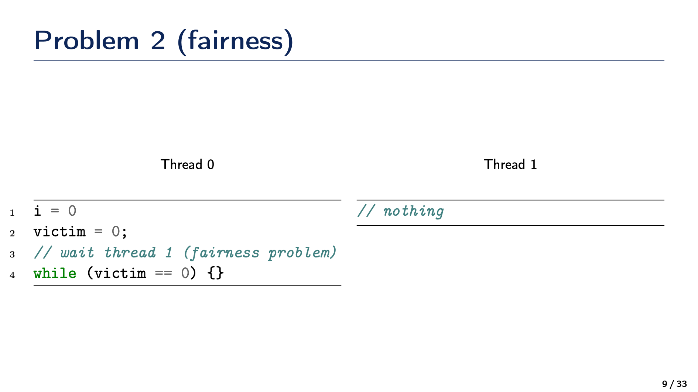
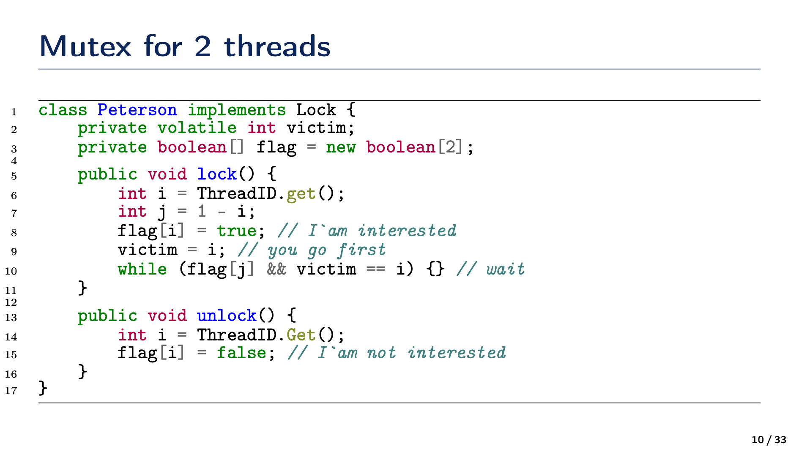

# 14. Взаимоблокировки. Опишите что это такое и приведите несколько примеров

```{glossary}
Взаимоблокировка (Deadlock)
    это ситуация в многозадачных системах, когда два или более процессов или потоков не могут продолжить выполнение, потому что каждый из них ожидает освобождения ресурса, занятого другим. 
```

## Классические условия возникновения взаимоблокировки

Считается, что взаимоблокировка возможна, если выполняются все четыре условия (Coffman conditions):

1. **Взаимное исключение (Mutual Exclusion)**. Каждый ресурс может находиться в режиме, который допускает доступ в один момент времени только к одному потоку (ресурс неделим).
2. **Удержание и ожидание (Hold and Wait)**. Процесс (или поток), уже удерживающий ресурс, запрашивает новые ресурсы и ждёт, пока они станут свободны. При этом он не освобождает уже занятый ресурс.
3. **Отсутствие принудительного освобождения (No Preemption)**. Ресурсы не могут быть принудительно отобраны у потока; только сам поток может освободить удерживаемый ресурс.
4. **Цикличное ожидание (Circular Wait).** Существует цикл потоков \( P_1, P_2, \dots, P_n \), где \( P_1 \) ждёт ресурс, удерживаемый \( P_2 \), \( P_2 \) ждёт ресурс, удерживаемый \( P_3 \), …, а \( P_n \) ждёт ресурс, удерживаемый \( P_1 \).

Если все эти условия выполняются одновременно, в системе потенциально может возникнуть взаимоблокировка.

```{dropdown} Доронин, 2023, раздел 2






```{figure} ../images/02_mtx/page-11.png
:name:doronin-mutex
Взаимоблокировки {cite}`доронин2023-2`
```

```{bibliography}
:style: unsrt
:filter: docname in docnames
```
