# 16. TCP vs UDP

```{figure} ../images/cn-p2-internet/page-36.png
:name: tcp-vs-udp

Сравнение TCP и UDP {cite}`алиев2024сети2`
```

```{dropdown} Алиев, 2024, раздел 2, Транспортные протоколы TCP/IP
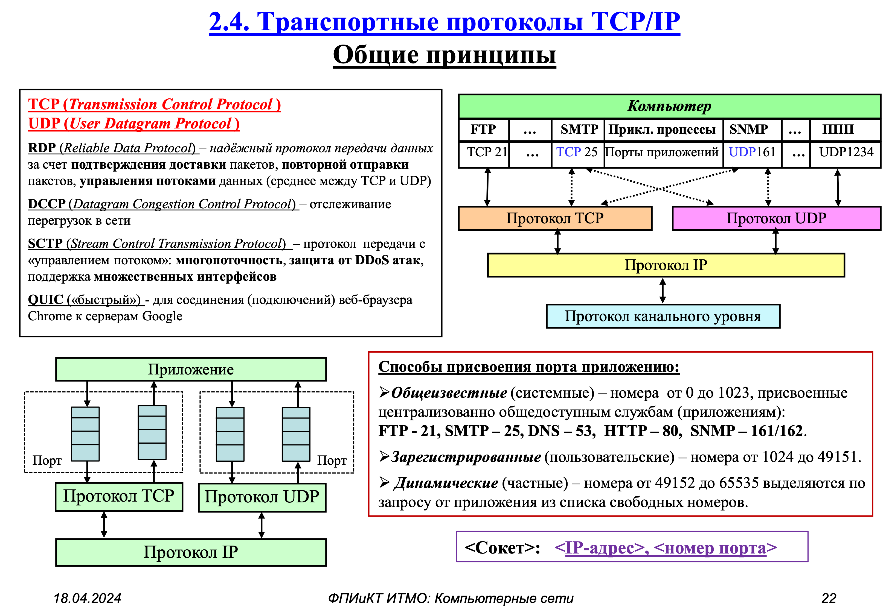
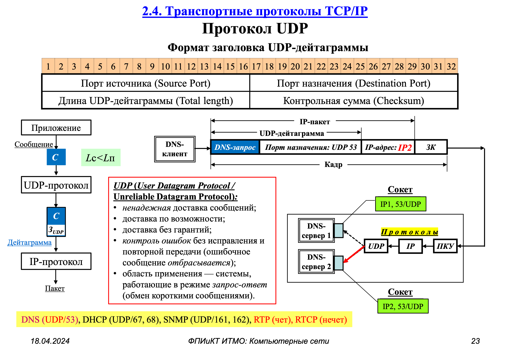
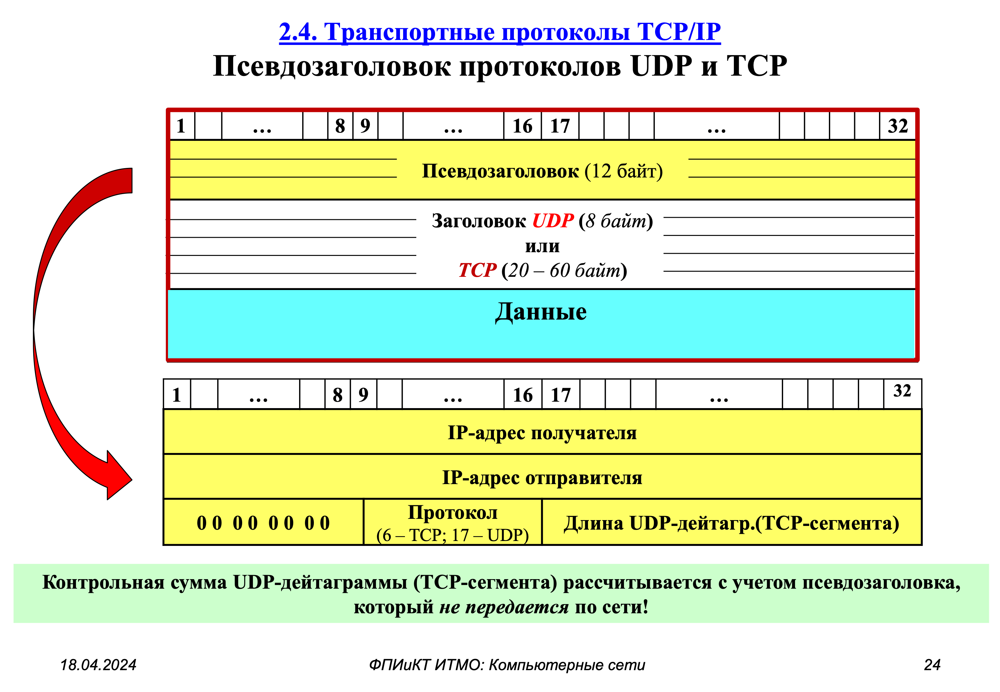
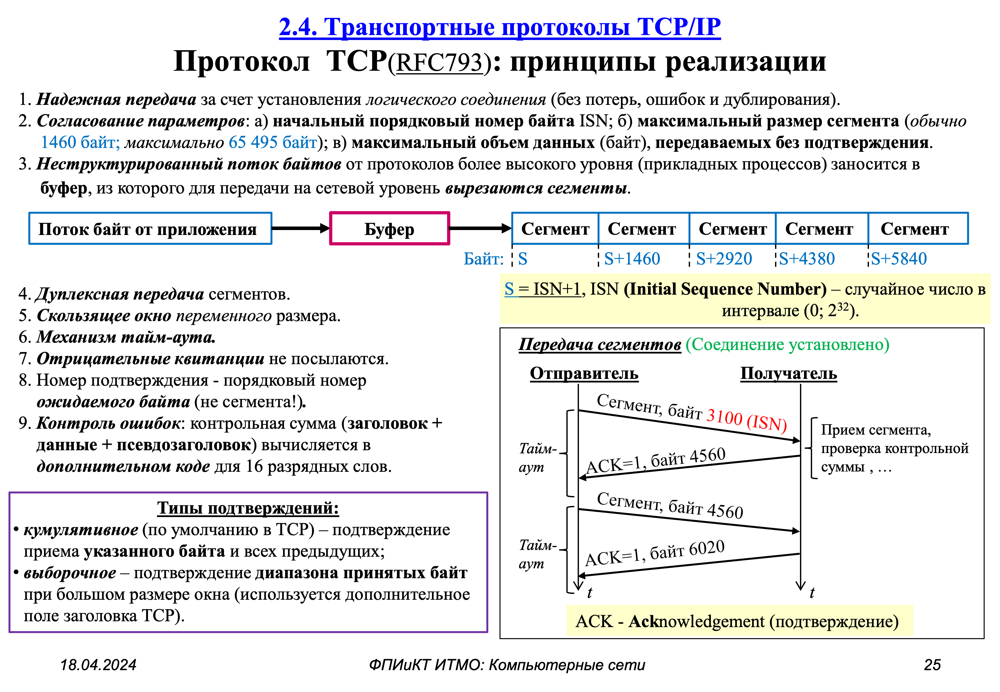
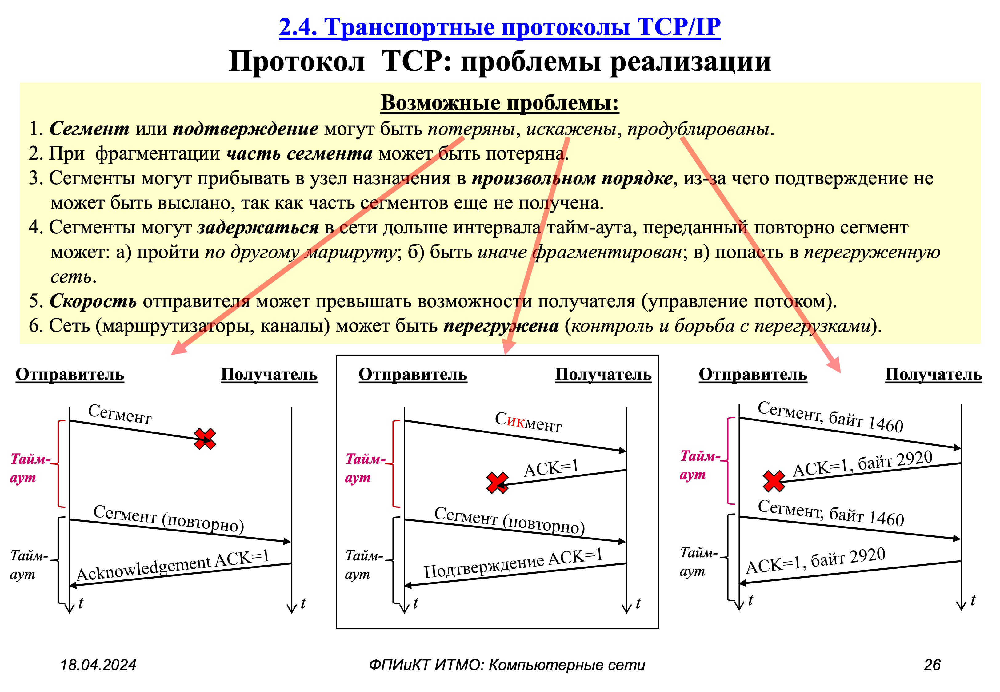
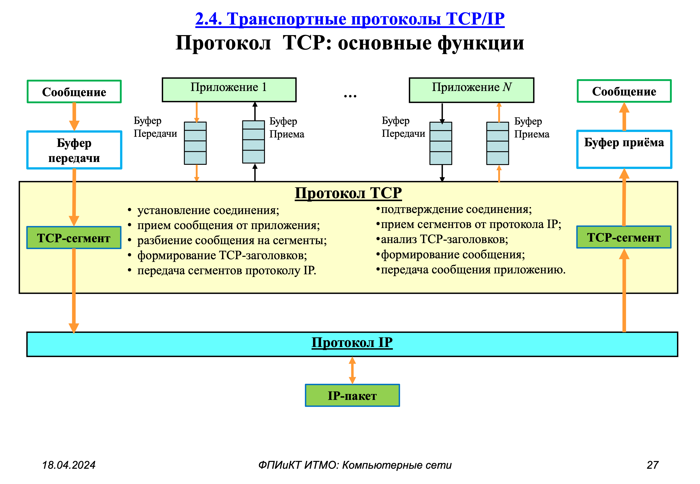
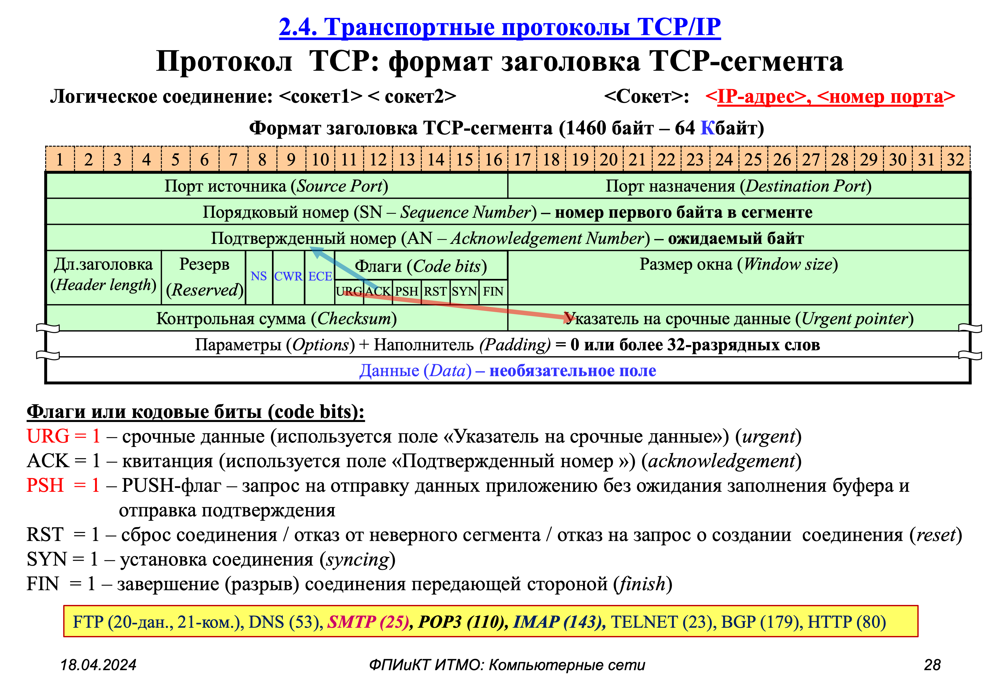
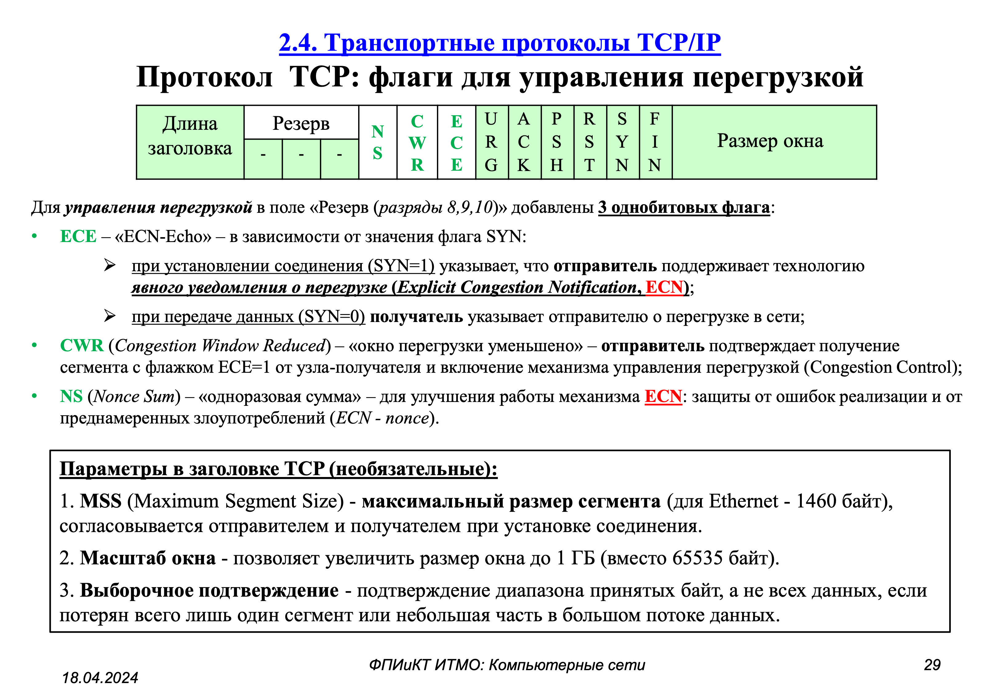
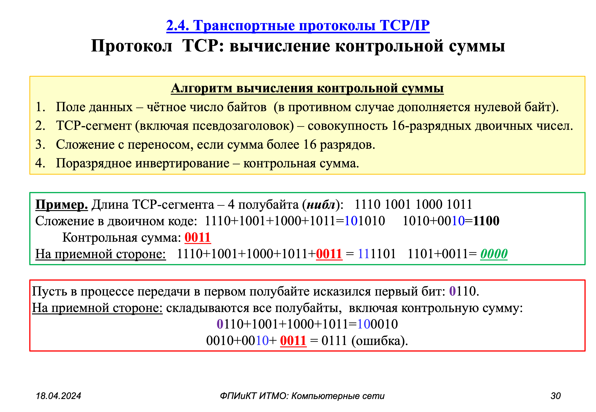

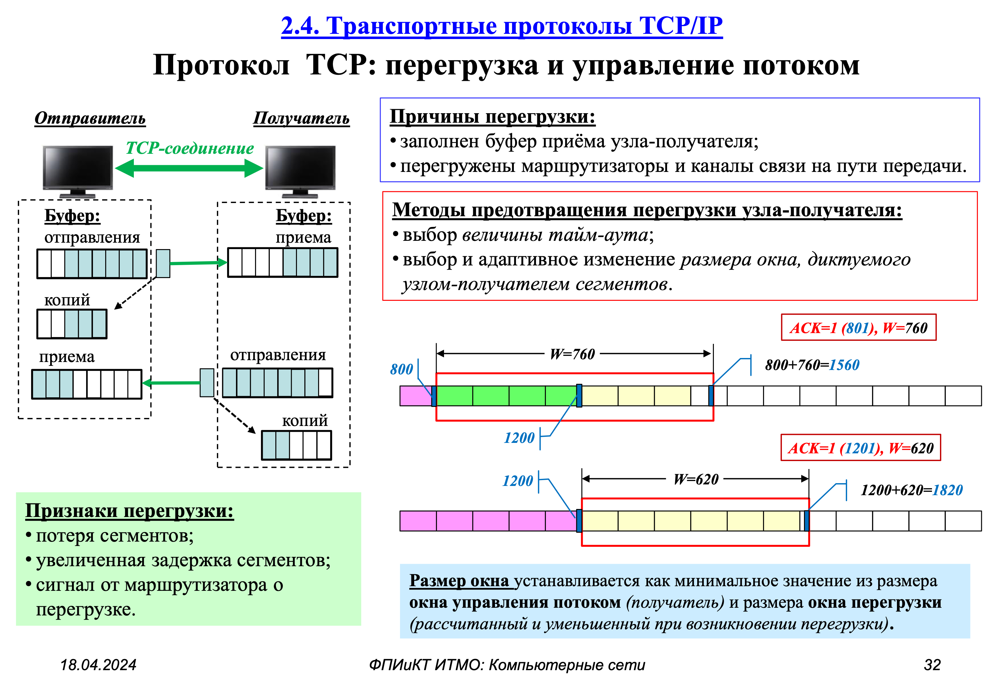
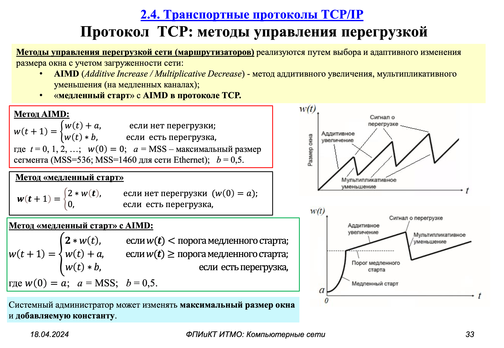


```{figure} ../images/cn-p2-internet/page-37.png
:name:doronin-mutex
Транспортные протоколы TCP/IP {cite}`алиев2024сети2`
```

```{bibliography}
:style: unsrt
:filter: docname in docnames
```
