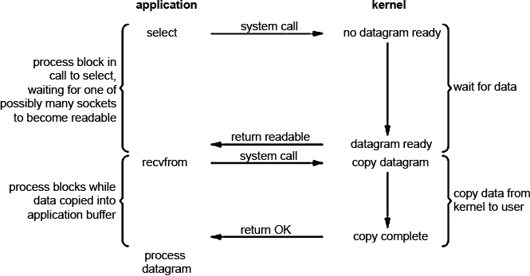
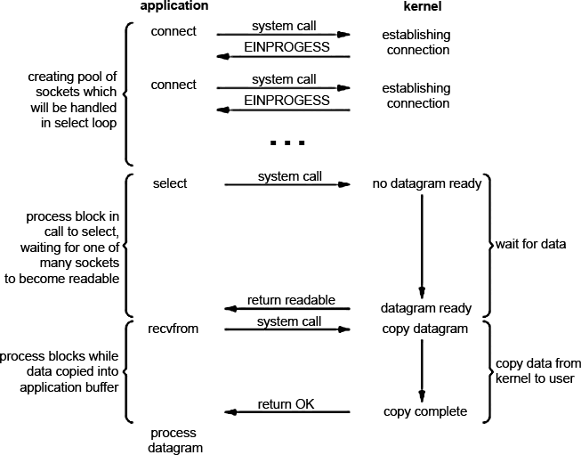

# 19. Мультиплексирование IO

```{glossary}
Мультиплексирование ввода/вывода (I/O multiplexing)
    это техника, позволяющая программе одновременно отслеживать несколько источников ввода/вывода, не блокируя выполнение на каждом из них.
```

Основная цель мультиплексирования заключается в повышении эффективности работы с ресурсами, позволяя обрабатывать данные от нескольких сокетов или файловых дескрипторов без необходимости создания отдельных потоков или процессов для каждого соединения.

## Принцип работы

При мультиплексировании ввода/вывода мы обращаемся к одному из доступных в ОС системному вызову (мультиплексору например select, poll, pselect, dev/poll, epoll (рекомендуемый для Linux), kqueue (BSD)) и на нем блокируемся вместо того, чтобы блокироваться на фактическом I/O вызове. Схематично процесс мультиплексирования представлен на изображении



Приложение блокируется при вызове select'a ожидая когда сокет станет доступным для чтения. Затем ядро возвращает нам статус readable и можно получать данные помощью recvfrom. На первый взгляд — сплошное разочарование. Та же блокировка, ожидание, да и еще 2 системных вызова (select и recvfrom) — высокие накладные расходы. Но в отличии от блокирующего метода, select (и любой другой мультиплексор) позволяет ожидать данные не от одного, а от нескольких файловых дескрипторов. Надо сказать, что это наиболее разумный метод для обслуживания множества клиентов, особенно если ресурсы достаточно ограничены. Почему это так? Потому что мультиплексор снижает время простоя (сна). Попробую объяснить следующим изображением



Создается пул дескрипторов, соответствующих сокетам. Даже если при соединении нам пришел ответ EINPROGRESS это значит, что соединение устанавливается, что нам никак не мешает, т.к. мультиплексор в ходе проверки все равно возьмет тот, который первый освободился.

В случае с мультиплексированием у нас в цикле проверяются ВСЕ сокеты и берется первый который готов. Пока мы с ним работаем, другие также могут подоспеть, тоесть мы снижаем время на простой (первый раз мы может ждем долго, но остальные разы — гораздо меньше). {cite}`Voltt2014Sep` {cite}`BibEntry2025Jan`

## Преимущества мультиплексирования

- Эффективность использования ресурсов: уменьшает время простоя процессора.
- Снижение накладных расходов: вместо создания множества потоков или процессов можно использовать один поток (или пул) для обработки нескольких соединений.
- Гибкость: возможность обработки событий от различных источников без блокировки выполнения программы.

## Недостатки мультиплексирования

- При использовании select существует ограничение на максимальное количество дескрипторов, которые могут быть отслежены одновременно.
- При увеличении числа соединений может возникнуть проблема с производительностью из-за необходимости постоянно опрашивать все дескрипторы

## Системные вызовы для мультиплексирования

- **select**: поддерживается большинством UNIX-систем, но имеет ограничения по масштабируемости из-за использования битовых карт для представления дескрипторов.
- **poll**: более современный подход, который также поддерживает множество дескрипторов, но может быть менее эффективным на больших объемах.
- **epoll**: рекомендованный для Linux, предлагает лучшую производительность и масштабируемость по сравнению с select и poll.

```{bibliography}
:style: unsrt
:filter: docname in docnames
```
