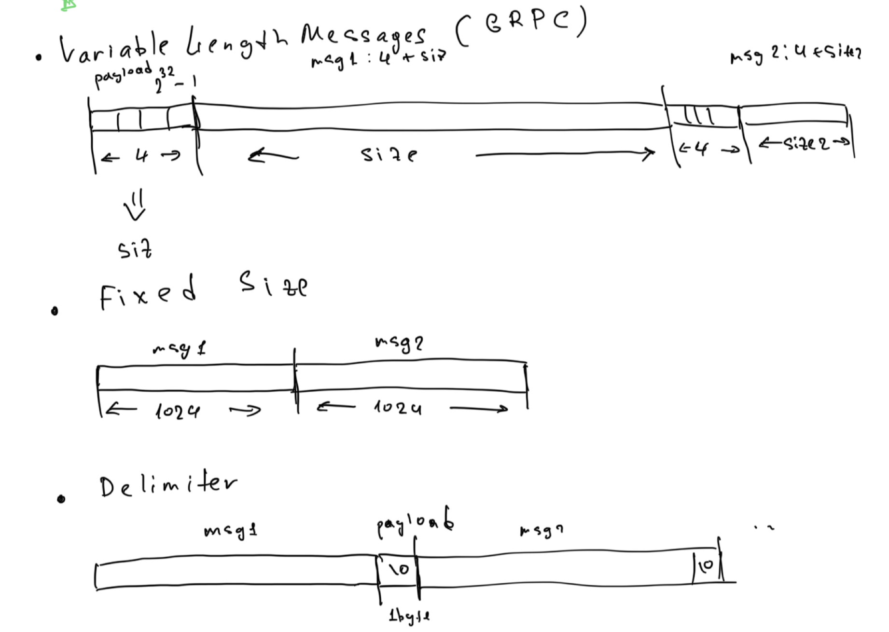

# 21. Message splitting over TCP

## Variable Length Messages

Каждому сообщению предшествует заголовок, определяющий его длину. Приемник сначала считывает заголовок длины, чтобы определить размер последующего тела сообщения, что обеспечивает точную пересборку. Этот метод поддерживает сообщения переменного размера.

## Fixed Size Messages

Отправитель и получатель договариваются о заранее определенном, постоянном размере сообщения. Получатель считывает данные в виде фрагментов фиксированного размера. Если сообщение короче фиксированной длины, отправитель добавляет в него padding. Несмотря на простоту, такой подход может быть неэффективным для сообщений разного размера из-за потенциальных накладных расходов. (экономия на payload)

## Delimiter-Based Messages

Сообщения разделяются с помощью специальных символов-разделителей (например, символов новой строки). Приемник читает поток до тех пор, пока не встретит разделитель, указывающий на конец сообщения. Этот метод требует тщательной обработки разделителей в содержимом сообщения, чтобы избежать неправильного толкования. (трудно работать с бинарными данными)

