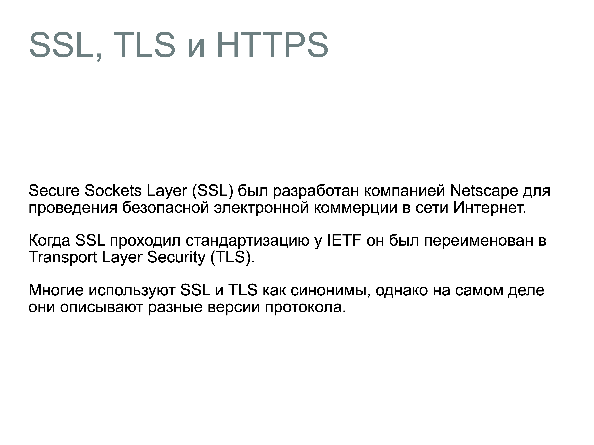
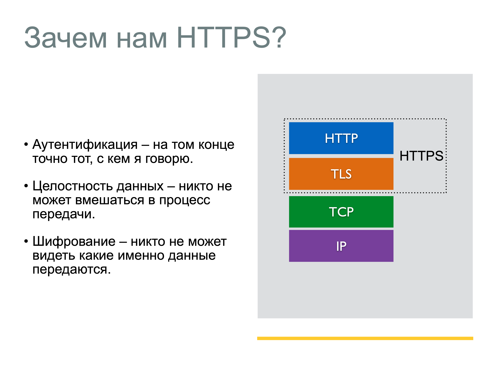
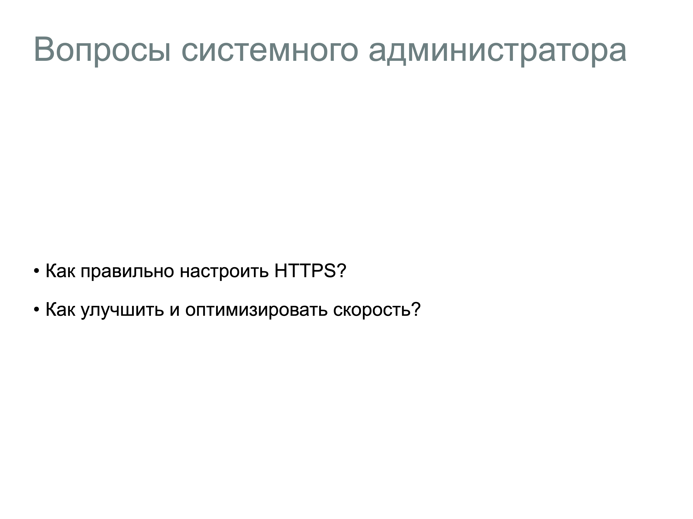
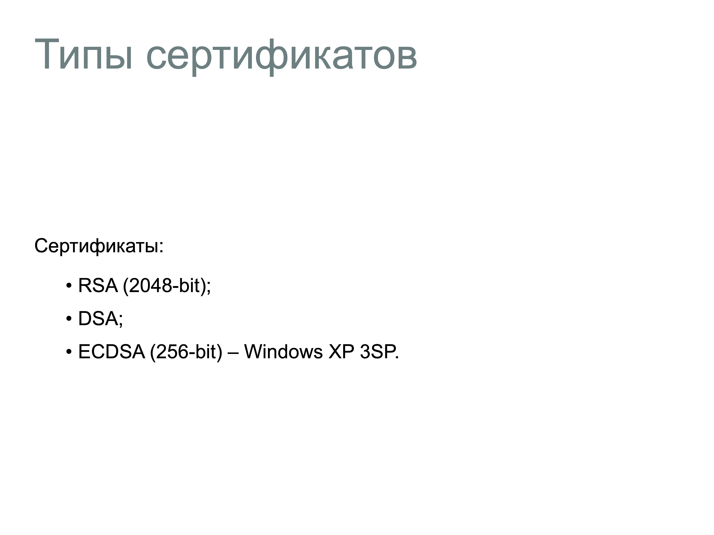
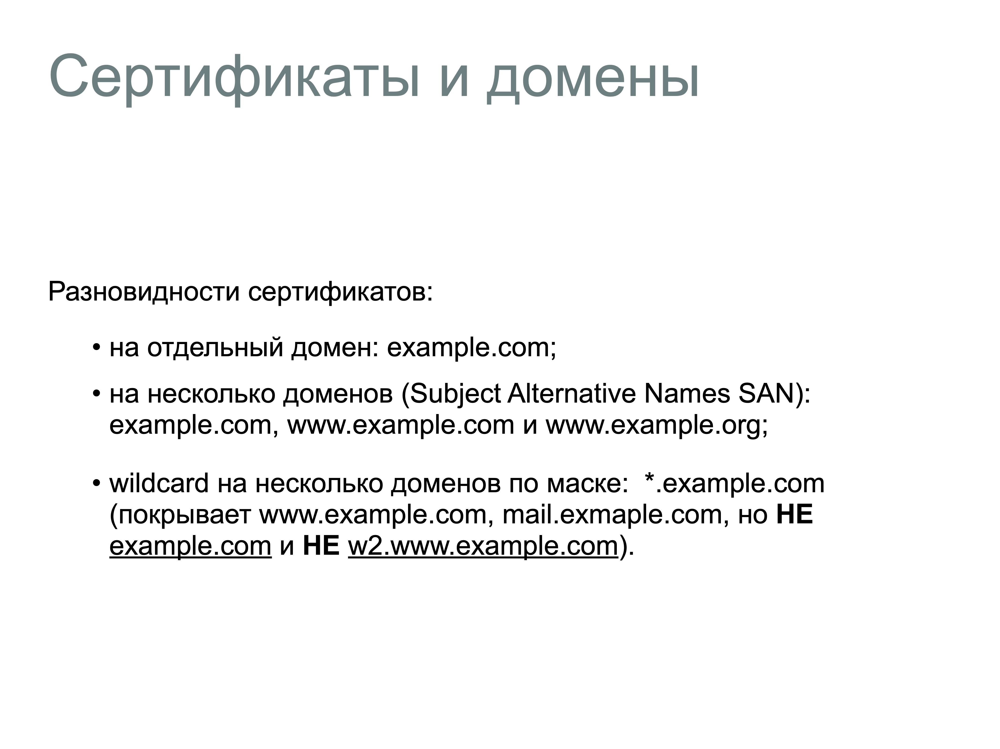
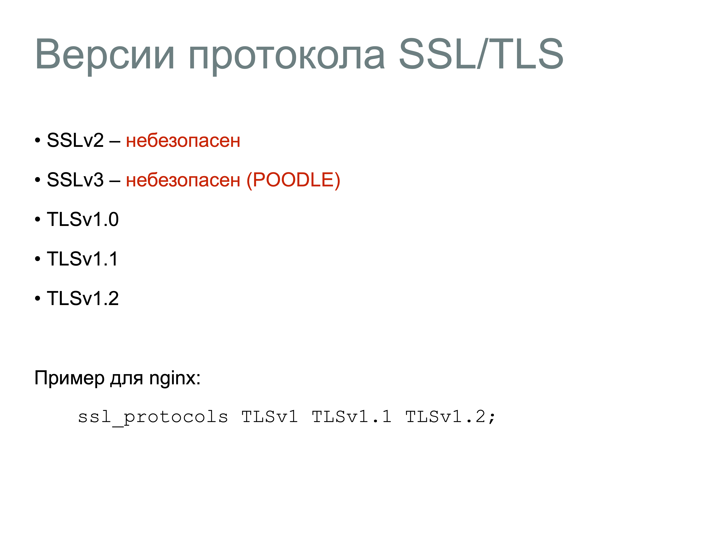
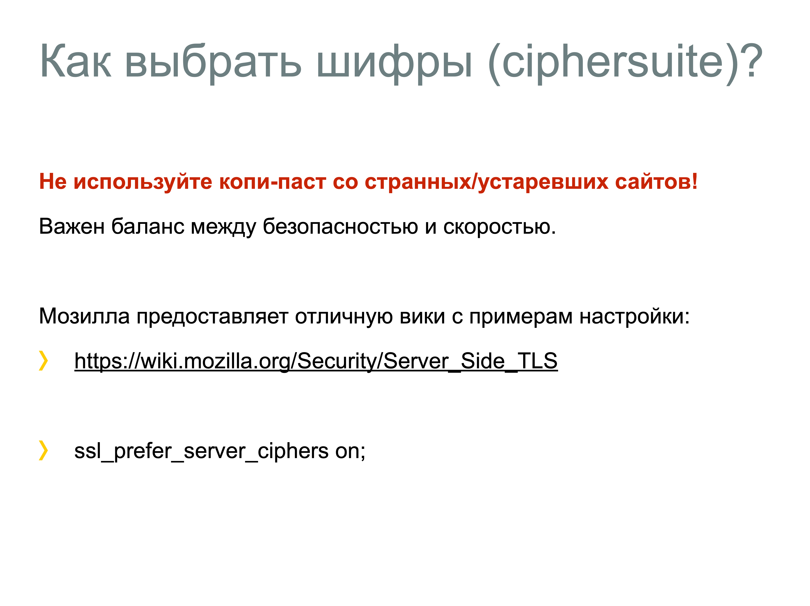
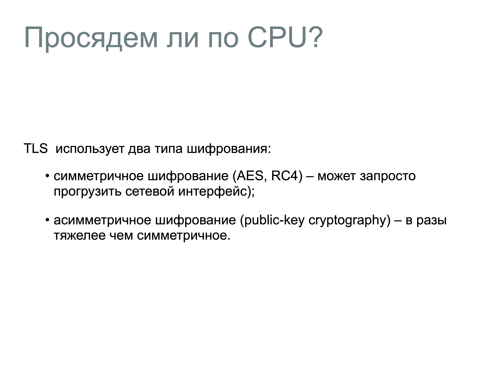
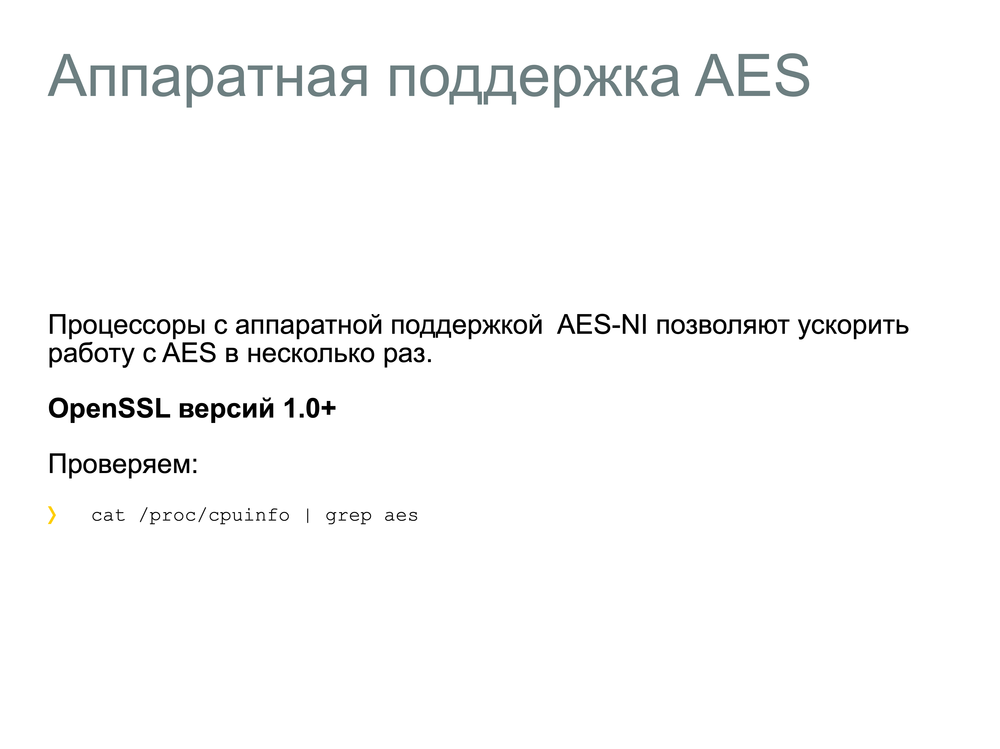

# 27. Опишите устройство протокола HTTPS

## Зачем нам HTTPS?

- **Аутентификация** - на том конце точно тот, с кем я говорю.
- **Целостность данных** - никто не может вмешаться в процесс передачи.
- **Шифрование** - никто не может видеть какие именно данные передаются.

## Основы HTTPS

- HTTPS работает поверх транспортного протокола TCP (обычно на порту 443).
- HTTPS использует протокол TLS (или SSL) для шифрования данных. 

## Процесс установления безопасного соединения (TLS Handshake)

Когда клиент (например, браузер) подключается к серверу по HTTPS, происходит следующий процесс:

1. **ClientHello**: Клиент отправляет серверу запрос с информацией о поддерживаемых версиях TLS и криптографических алгоритмах.
2. **ServerHello**: Сервер отвечает, выбирая подходящую версию TLS и алгоритмы, а также отправляет свой цифровой сертификат.
3. **Проверка сертификата**: Клиент проверяет сертификат сервера с помощью доверенного центра сертификации.
4. **Обмен ключами**: Клиент и сервер обмениваются криптографическими ключами для шифрования данных. Обычно используется асимметричное шифрование для обмена ключами и симметричное шифрование для передачи данных.
5. **Завершение handshake**: После успешного обмена ключами соединение считается установленным, и начинается передача зашифрованных данных.

```{dropdown} Доронин, 2023, раздел 4









```{figure} ../images/04_lecture_http_https/page-28.png
:name:doronin-https
HTTPS {cite}`доронин2023-4`
```

```{bibliography}
:style: unsrt
:filter: docname in docnames
```