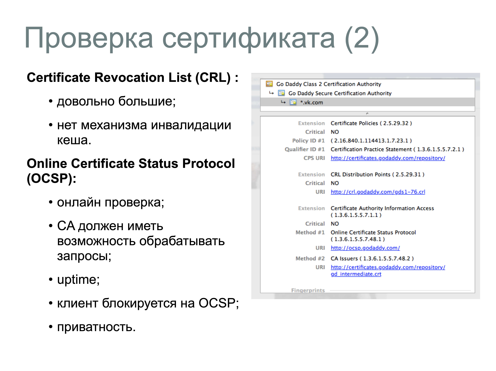

# 28. Что такое сертификаты? Приведите примеры их использования

```{glossary}
Цифровой сертификат
    это электронный документ, подтверждающий связь между открытым ключом и определённым субъектом (человеком, организацией или устройством). Он используется для аутентификации, шифрования данных и обеспечения целостности информации в цифровых коммуникациях.
```

## Типы сертификатов

1. **RSA (Rivest-Shamir-Adleman)** (2048-bit) — один из самых известных алгоритмов асимметричного шифрования. Используется для шифрования данных и цифровых подписей.
2. **DSA (Digital Signature Algorithm)** — используется для создания цифровых подписей.
3. **ECDSA (256-bit)** – алгоритм эллиптической кривой, используется для создания цифровых подписей.

## Сертификаты и домены

Разновидности сертификатов:

- на отдельный домен: example.com
- на несколько доменов (Subject Alternative Names SAN): example.com, www.example.com u www.example.org;
- wildcard на несколько доменов по маске: *.example.com (покрывает www.example.com, mail.exmaple.com, но HE example.com n HE w2.www.example.com).

## Примеры использования цифровых сертификатов:

- **Безопасный веб-сёрфинг (SSL/TLS)**: При посещении веб-сайтов с HTTPS цифровые сертификаты обеспечивают шифрование соединения между браузером пользователя и сервером, защищая данные от перехвата и подтверждая подлинность сайта.
Пример: сертификат для домена example.com, выданный центром сертификации вроде Let's Encrypt или DigiCert.

- **Электронная подпись документов**: Цифровые сертификаты позволяют подписывать электронные документы, что придает им юридическую силу. Это используется в бизнесе, государственных услугах и других сферах.
Пример: подписание договоров, налоговых деклараций или отчетов.

- **Аутентификация VPN**: Виртуальные частные сети (VPN) используют цифровые сертификаты для аутентификации пользователей и шифрования соединений, что обеспечивает безопасность при удаленном доступе к корпоративным ресурсам.

- **Защита электронной почты (S/MIME)**: Цифровые сертификаты позволяют шифровать и подписывать электронные письма, обеспечивая конфиденциальность и подтверждение отправителя.

- **Подпись кода**: Разработчики программного обеспечения применяют цифровые сертификаты для подписания своего кода, удостоверяя его подлинность и подтверждая, что он не был изменён после подписания. 

```{dropdown} Доронин, 2023, раздел 4




```{figure} ../images/04_lecture_http_https/page-42.png
:name:digitsign 
Цифровые сертификаты {cite}`доронин2023-4`
```

```{bibliography}
:style: unsrt
:filter: docname in docnames
```
