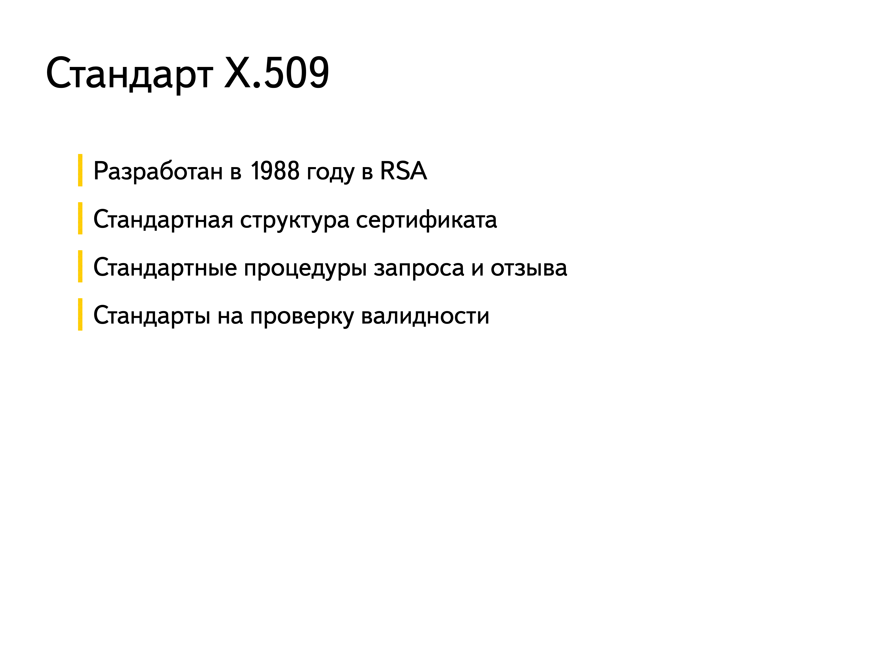
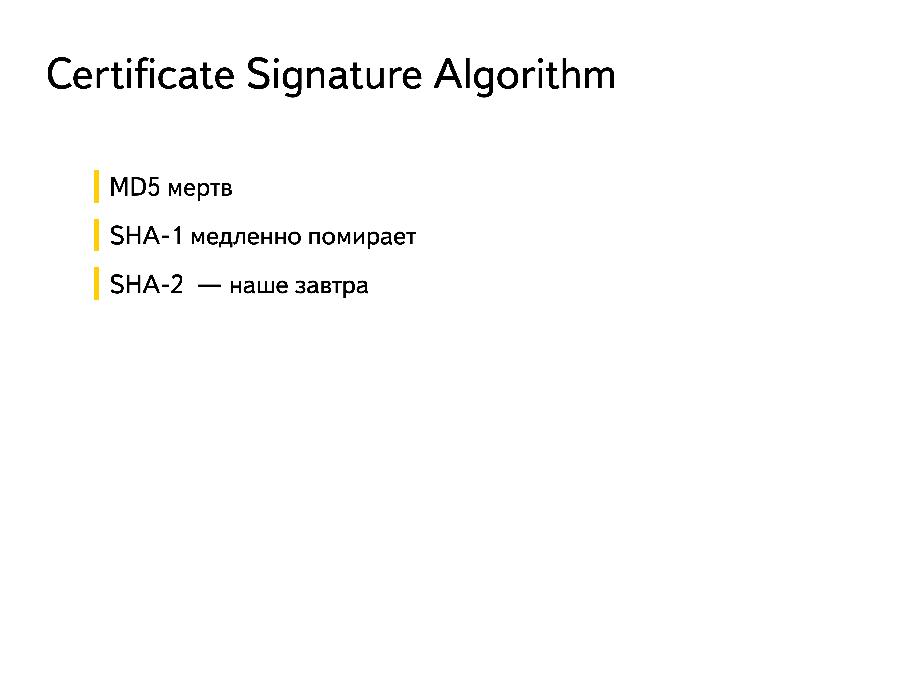
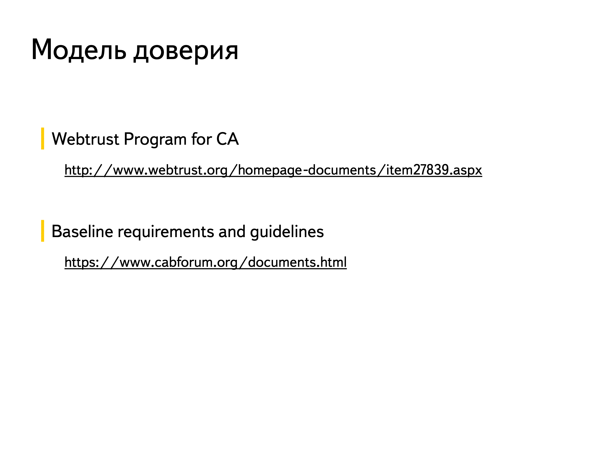

# 29. Опишите PKI и детали реализации

**PKI (Public Key Infrastructure)**

- Certificate Authority (УЦ) - сущность, которой все доверяют
- УЦ выпускает сертификаты субъектам
- Возможность делегирования функций (Subordinate CA)
- Иерархическая система доверия

## Основные компоненты PKI

1. **Центр сертификации (CA, Certificate Authority)**:
   - Организация или система, которая выпускает и управляет цифровыми сертификатами.
   - Проверяет подлинность запросов на сертификаты и подписывает их своим закрытым ключом.
   - Может быть корневым (Root CA) или промежуточным (Intermediate CA).

2. **Регистрационный центр (RA, Registration Authority)**:
   - Выполняет проверку данных пользователей перед выдачей сертификатов.
   - Передает запросы на выпуск сертификатов в CA.

3. **Хранилище сертификатов (Certificate Repository)**:
   - База данных или каталог, где хранятся выданные сертификаты и списки отозванных сертификатов (CRL, Certificate Revocation List).

4. **Цифровые сертификаты**:
   - Электронные документы, связывающие открытый ключ с идентификатором владельца (например, именем или доменом).
   - Содержат информацию о владельце, сроке действия, издателе и подпись CA.

5. **Списки отозванных сертификатов (CRL)**:
   - Список сертификатов, которые были отозваны до истечения срока их действия.
   - Используется для проверки действительности сертификатов.

6. **Протокол OCSP (Online Certificate Status Protocol)**:
   - Альтернатива CRL, позволяющая проверять статус сертификата в реальном времени.

7. **Политики и процедуры**:
   - Документы, определяющие правила использования PKI, включая выпуск, отзыв и управление сертификатами.

---

## Детали реализации PKI

1. **Генерация ключей**:
   - Пользователь генерирует пару ключей (открытый и закрытый) с использованием криптографических алгоритмов (например, RSA, ECC).
   - Закрытый ключ хранится в безопасном месте, а открытый ключ передается в CA для включения в сертификат.

2. **Запрос сертификата**:
   - Пользователь отправляет запрос на сертификат (CSR, Certificate Signing Request) в CA через RA.
   - CSR содержит открытый ключ и информацию о владельце.

3. **Проверка и выпуск сертификата**:
   - CA проверяет данные пользователя и подписывает сертификат своим закрытым ключом.
   - Сертификат выдается пользователю и публикуется в хранилище.

4. **Использование сертификата**:
   - Сертификат используется для шифрования данных, подписи документов или аутентификации.
   - При проверке сертификата проверяется его подпись CA, срок действия и статус (через CRL или OCSP).

5. **Отзыв сертификата**:
   - Если сертификат скомпрометирован или больше не нужен, он отзывается через добавление в CRL или через OCSP.

6. **Обновление сертификата**:
   - По истечении срока действия сертификата пользователь может запросить его обновление.

---

## Инфраструктура PKI

- Корневой УЦ (Root CA)
- Подчиненные УЦ (Intermediate CA)
- Защищенное хранилище для закрытого ключа (HSM)
- Набор политик и регламентов
- Каталог выданных сертификатов
- Каталог отозванных сертификатов

```{dropdown} Доронин, 2023, раздел 4








```{figure} ../images/04_lecture_http_https/page-53.png
:name:doronin-pki
PKI {cite}`доронин2023-4`
```

```{bibliography}
:style: unsrt
:filter: docname in docnames
```