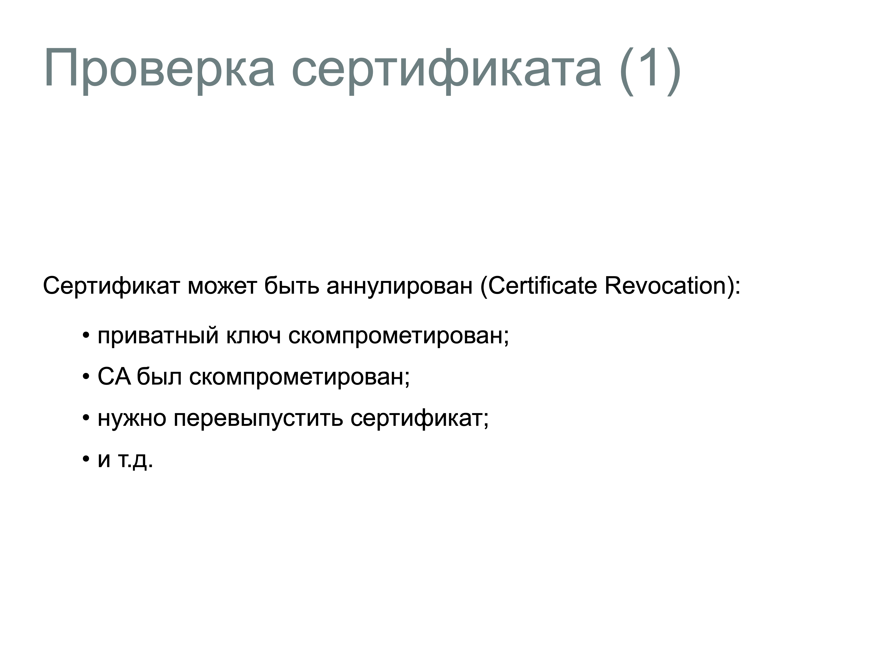
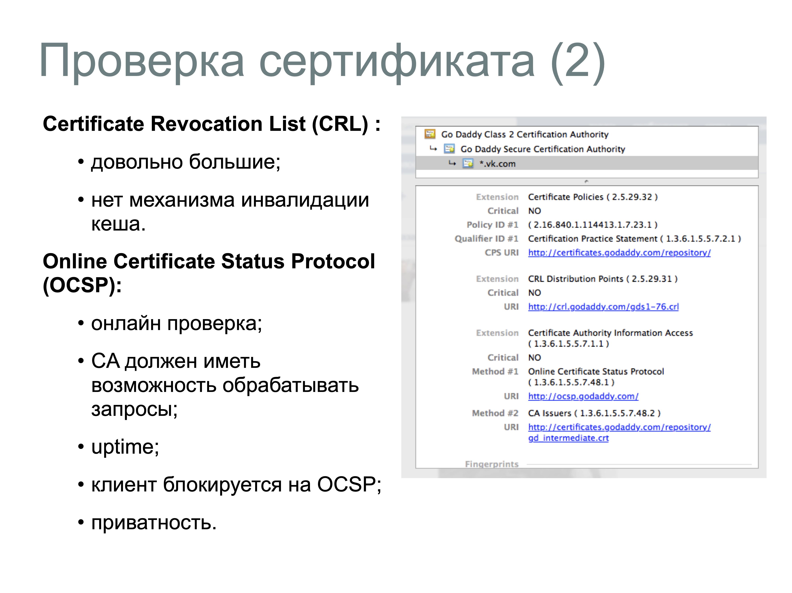
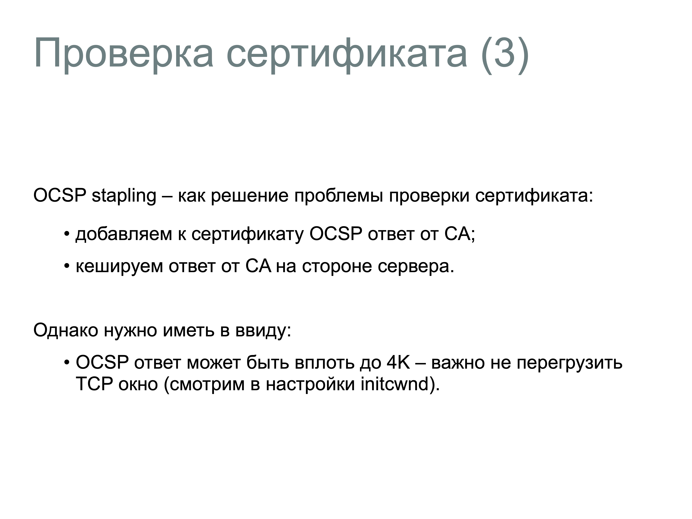
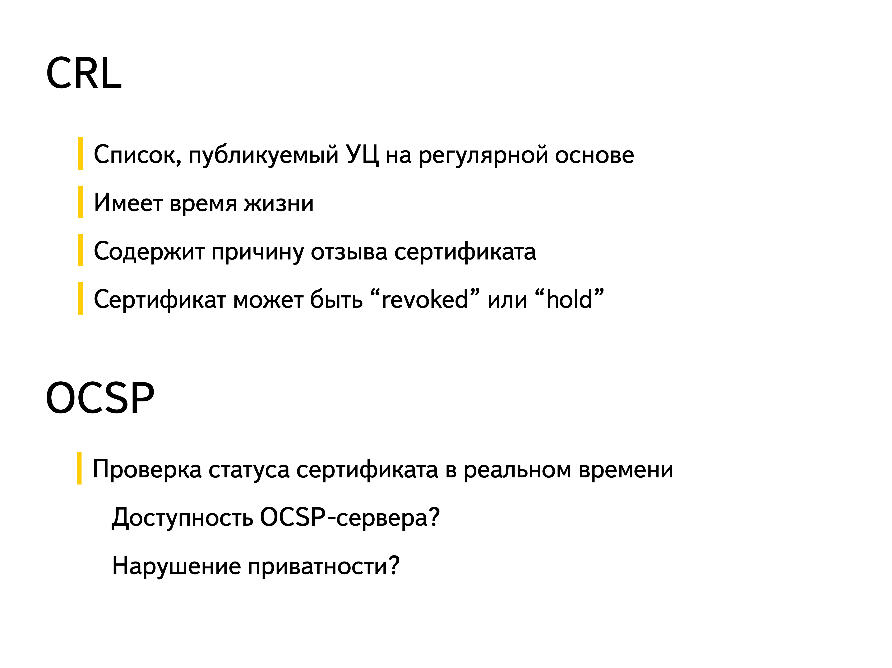

# 30. CRL и OCSP

## CRL

- Список, публикуемый УЦ на регулярной основе
- Имеет время жизни
- Содержит причину отзыва сертификата
- Сертификат может быть "revoked"(отозванный) или "hold"(удержанный)

CRL представляет собой список сертификатов, отозванных удостоверяющим центром (CA) до истечения их срока действия. Этот список регулярно обновляется и публикуется CA. Для проверки статуса сертификата клиент должен загрузить актуальный CRL и убедиться, что проверяемый сертификат отсутствует в этом списке. Однако размер CRL может быть значительным, что приводит к увеличению нагрузки на сеть и задержкам при проверке.

## OCSP

- Проверка статуса сертификата в реальном времени

OCSP позволяет клиенту отправить запрос на сервер OCSP (обычно поддерживаемый CA) для получения статуса конкретного сертификата в режиме реального времени. Сервер OCSP отвечает статусом сертификата: "действителен", "отозван" или "неизвестен". OCSP обеспечивает более оперативную проверку статуса сертификата и снижает нагрузку на сеть по сравнению с CRL, поскольку передается меньше данных. 

## OCSP Stapling

Для повышения производительности и конфиденциальности был разработан механизм OCSP Stapling. В этом случае веб-сервер периодически запрашивает статус своего сертификата у OCSP-сервера и "прикрепляет" (staple) полученный ответ к своему сертификату при установлении TLS-соединения с клиентом. Это устраняет необходимость для клиента напрямую обращаться к OCSP-серверу, улучшая скорость соединения и защищая конфиденциальность пользователя. 

## Сравнение CRL и OCSP:

- **Эффективность**: OCSP обычно более эффективен, так как позволяет проверять статус конкретного сертификата без необходимости загружать весь список отозванных сертификатов, как в случае с CRL.
- **Конфиденциальность**: При использовании OCSP клиент раскрывает информацию о посещаемом ресурсе OCSP-серверу, что может вызывать опасения относительно конфиденциальности. OCSP Stapling решает эту проблему, так как клиент получает статус сертификата непосредственно от сервера, с которым устанавливает соединение.

```{dropdown} Доронин, 2023, раздел 4




```{figure} ../images/04_lecture_http_https/page-54.png
:name:doronin-x509
CRL и OCSP {cite}`доронин2023-4`
```

```{bibliography}
:style: unsrt
:filter: docname in docnames
```