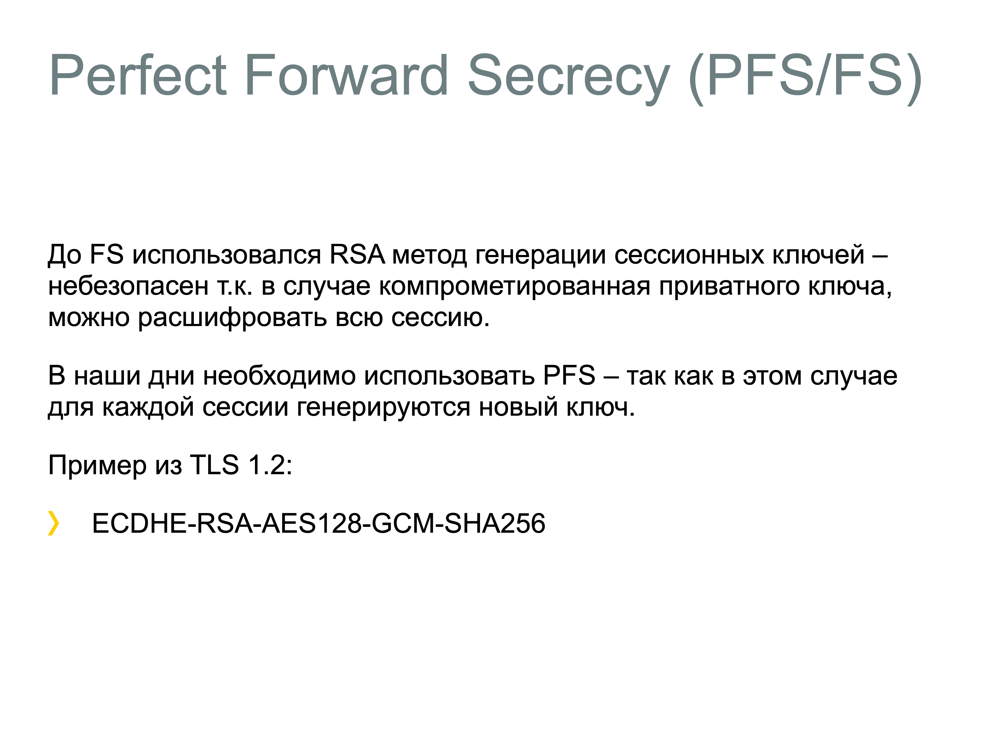

# 31. Perfect Forward Secrecy
```{glossary}
Perfect Forward Secrecy (PFS)
    это свойство криптографических протоколов, которое обеспечивает конфиденциальность прошлых сессий связи, даже если в будущем будут скомпрометированы долгосрочные ключи шифрования. Это достигается за счет использования уникальных временных ключей для каждой сессии, которые удаляются после завершения сессии. Таким образом, даже если злоумышленник получит доступ к долгосрочному ключу, он не сможет расшифровать ранее записанные данные
```

```{dropdown} Доронин, 2023, раздел 4

```{figure} ../images/04_lecture_http_https/page-56.png
:name:doronin-x509
Perfect Forward Secrecy {cite}`доронин2023-4`
```

```{bibliography}
:style: unsrt
:filter: docname in docnames
```