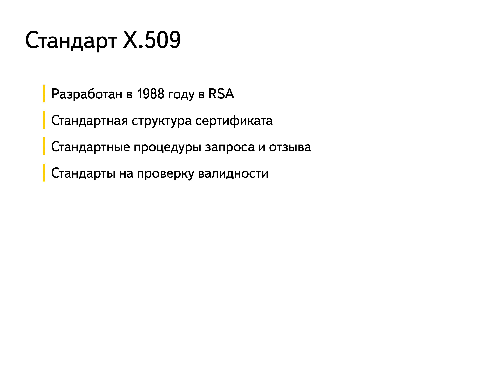
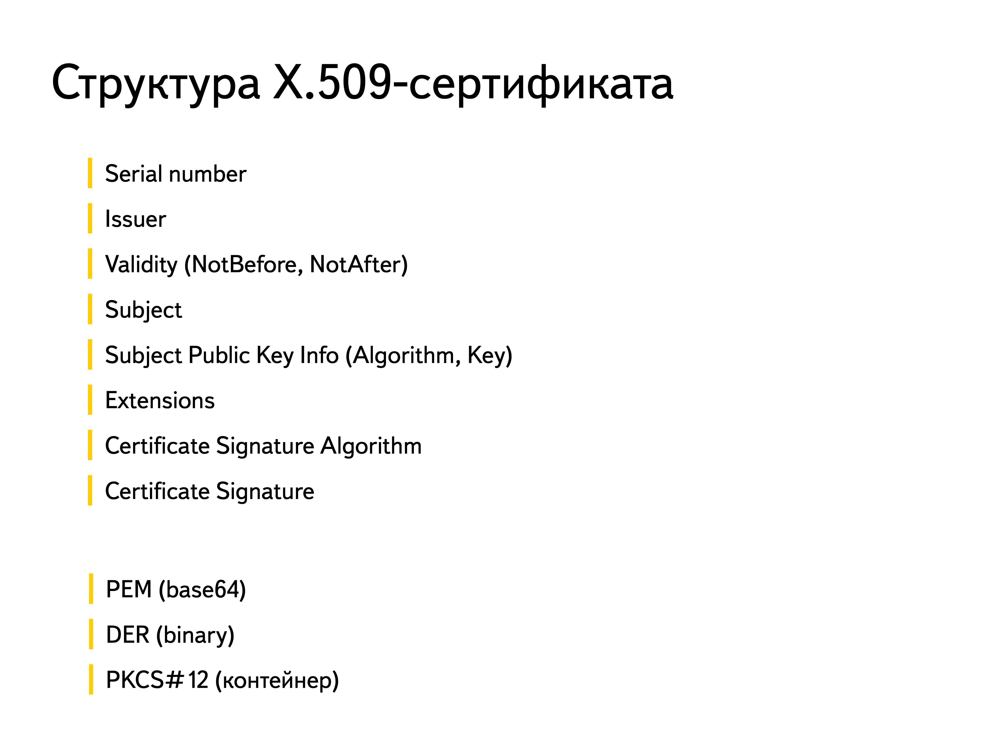
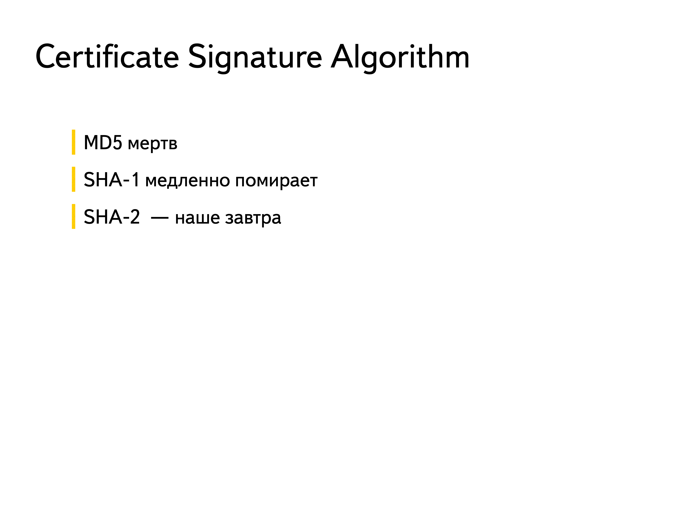

# 32. Структура X.509-сертификата

- Разработан в 1988 году в RSA
- Стандартная структура сертификата
- Стандартные процедуры запроса и отзыва
- Стандарты на проверку валидности

## Структура X.509-сертификата

### 1. Версия (Version)
Указывает версию стандарта X.509, используемую в сертификате. Возможные значения:

- Версия 1 (обычно не используется)
- Версия 2 (добавлены уникальные идентификаторы)
- Версия 3 (наиболее распространённая, поддерживает расширения)

### 2. Серийный номер (Serial Number)

- Уникальный идентификатор сертификата, присваиваемый центром сертификации (CA). Используется для однозначной идентификации сертификата в рамках CA.

### 3. Издатель (Issuer)

- Информация о центре сертификации (CA), который выпустил сертификат. Обычно включает:
  - Название организации (O)
  - Общее имя (CN)
  - Страну (C)
  - Другие атрибуты (например, OU — организационное подразделение).

### 4. Срок действия (Validity)

- Период, в течение которого сертификат считается действительным. Включает:
  - Дата начала действия (Not Before)
  - Дата окончания действия (Not After)

### 5. Субъект (Subject)

- Информация о субъекте сертификата. Обычно включает:
  - Название организации (O)
  - Общее имя (CN)
  - Страну (C)
  - Другие атрибуты (например, OU — организационное подразделение).

### 6. Открытый ключ (Subject Public Key Info)

- Содержит открытый ключ владельца сертификата и информацию о алгоритме ключа:
  - **Algorithm** — алгоритм, используемый для ключа (например, RSA, ECDSA).
  - **Public Key** — сам открытый ключ.

### 7. Расширения (Extensions)

- Дополнительные поля, доступные в версии X.509 v3. Расширения предоставляют дополнительную информацию о сертификате. Примеры расширений:
  - **Key Usage** — определяет назначение ключа (например, цифровая подпись, шифрование).
  - **Extended Key Usage** — уточняет использование сертификата (например, серверная аутентификация, клиентская аутентификация).
  - **Subject Alternative Name (SAN)** — альтернативные имена для субъекта (например, дополнительные домены).
  - **Basic Constraints** — указывает, является ли сертификат сертификатом CA.
  - **CRL Distribution Points** — URL для списка отозванных сертификатов (CRL).
  - **Authority Key Identifier** — идентификатор ключа CA.
  - **Subject Key Identifier** — идентификатор ключа субъекта.

### 8. Алгоритм подписи (Signature Algorithm)

- Указывает алгоритм, используемый центром сертификации для подписи сертификата.

### 9. Подпись (Signature)

- Цифровая подпись, созданная центром сертификации (CA) с использованием его закрытого ключа. Подпись охватывает все данные сертификата и подтверждает их подлинность.

## PEM, DER и PKCS#12 

Форматы **PEM**, **DER** и **PKCS#12** используются для хранения и передачи криптографических данных, таких как сертификаты, закрытые ключи и другие объекты.

Форматы **PEM**, **DER** и **PKCS#12** используются для хранения и передачи криптографических данных, таких как сертификаты, закрытые ключи и другие объекты. Каждый из этих форматов имеет свои особенности и применяется в различных сценариях. Рассмотрим их подробнее.

---

### 1. PEM (Privacy-Enhanced Mail)

- **Описание**: Текстовый формат, использующий кодировку Base64 для представления бинарных данных. PEM-файлы легко читаются и редактируются.
- **Структура**:
  - Данные кодируются в Base64 и разделяются на строки по 64 символа.
  - Начало и конец данных обозначаются специальными строками:
    - Начало: `-----BEGIN <тип данных>-----`
    - Конец: `-----END <тип данных>-----`
- **Пример**:
  ```pem
  -----BEGIN CERTIFICATE-----
  MIIE... (Base64-encoded data)
  -----END CERTIFICATE-----
  ```
- **Применение**:
  - Используется в конфигурациях веб-серверов (например, Apache, Nginx).
  - Легко читается и редактируется.
  - Подходит для хранения сертификатов и ключей в текстовом виде.

---

### 2. DER (Distinguished Encoding Rules)

- **Описание**: Бинарный формат, используемый для кодирования данных в соответствии с ASN.1 (Abstract Syntax Notation One). DER-файлы не читаются человеком.
- **Структура**:
  - Данные хранятся в бинарном виде.
  - Не содержит текстовых маркеров, как PEM.
- **Пример**:
  - Файл `.der` или `.cer` (бинарный).
- **Применение**:
  - Используется в системах, где требуется компактное хранение данных.
  - Подходит для встраивания в устройства или передачи по сети.
  - Часто используется в Windows для импорта сертификатов.

---

### 3. PKCS#12 (Public Key Cryptography Standards #12)

- **Описание**: Контейнерный формат для хранения нескольких криптографических объектов (например, сертификатов и закрытых ключей) в одном файле. Файлы PKCS#12 обычно имеют расширение `.p12` или `.pfx`.
- **Структура**:
  - Может содержать:
    - Сертификаты (включая цепочку сертификатов).
    - Закрытые ключи.
    - Дополнительные атрибуты.
  - Данные шифруются с использованием пароля.
- **Пример**:
  - Файл `.p12` или `.pfx`.
- **Применение**:
  - Используется для экспорта и импорта сертификатов и ключей между системами.
  - Подходит для передачи всех необходимых данных (сертификат + ключ) в одном файле.
  - Часто используется в Windows и Java-приложениях.

```{dropdown} Доронин, 2023, раздел 4



```{figure} ../images/04_lecture_http_https/page-53.png
:name:doronin-x509
X.509-сертификат {cite}`доронин2023-4`
```

```{bibliography}
:style: unsrt
:filter: docname in docnames
```