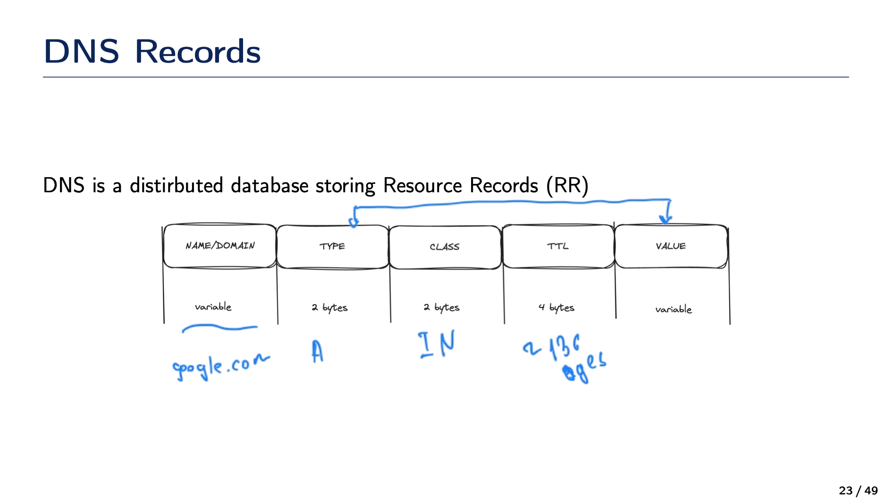
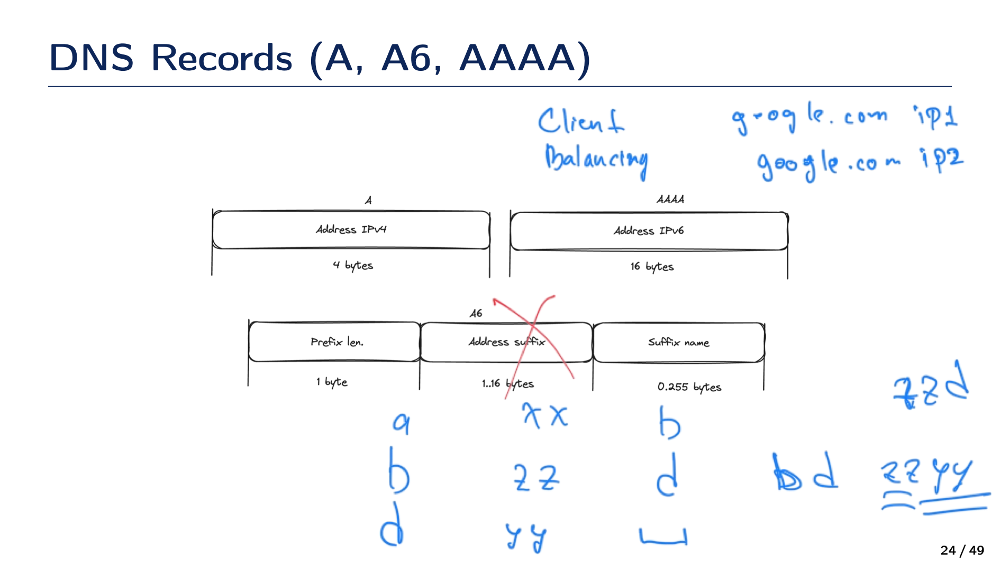
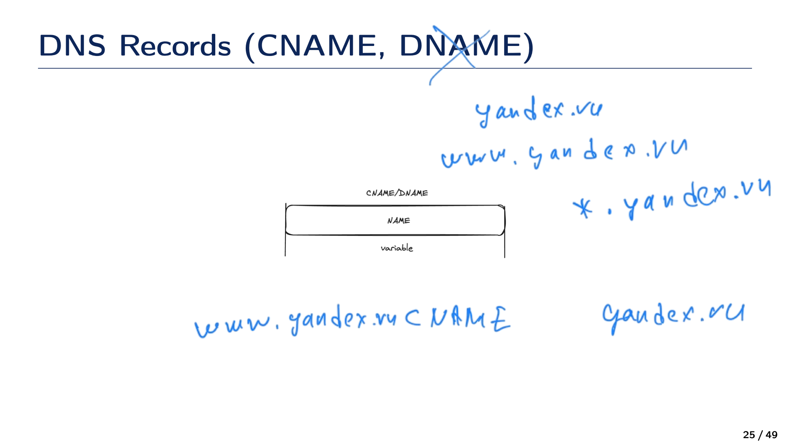
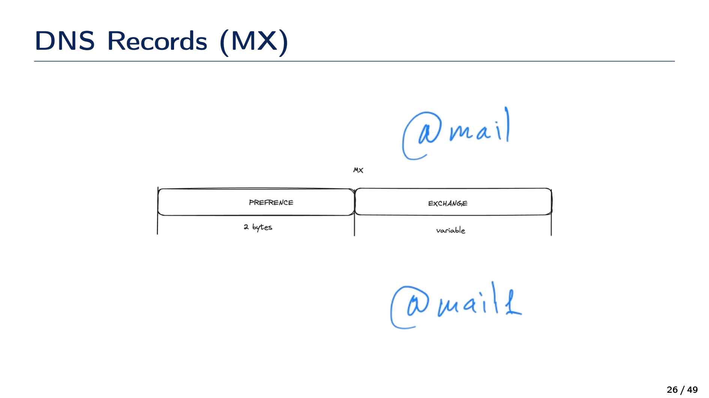
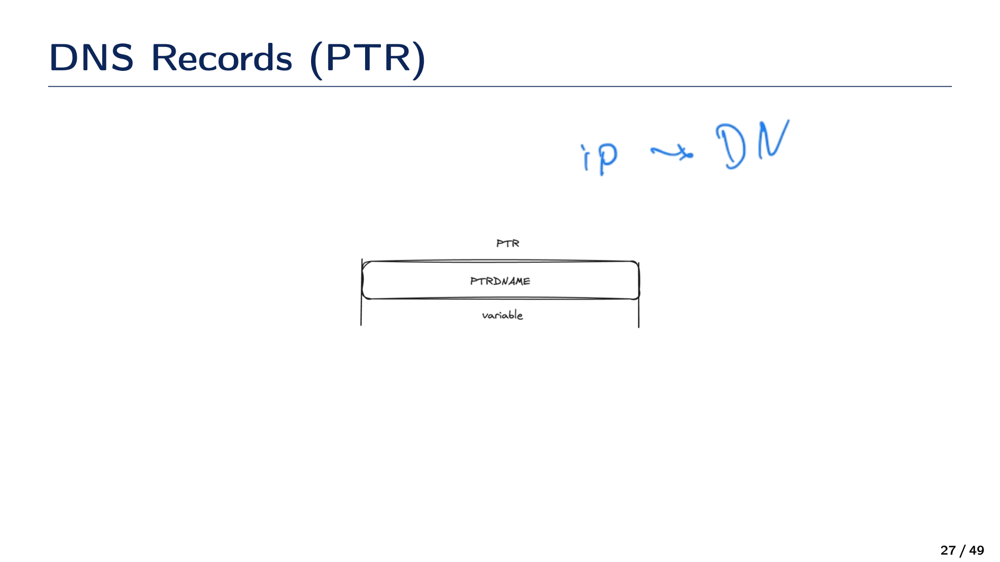
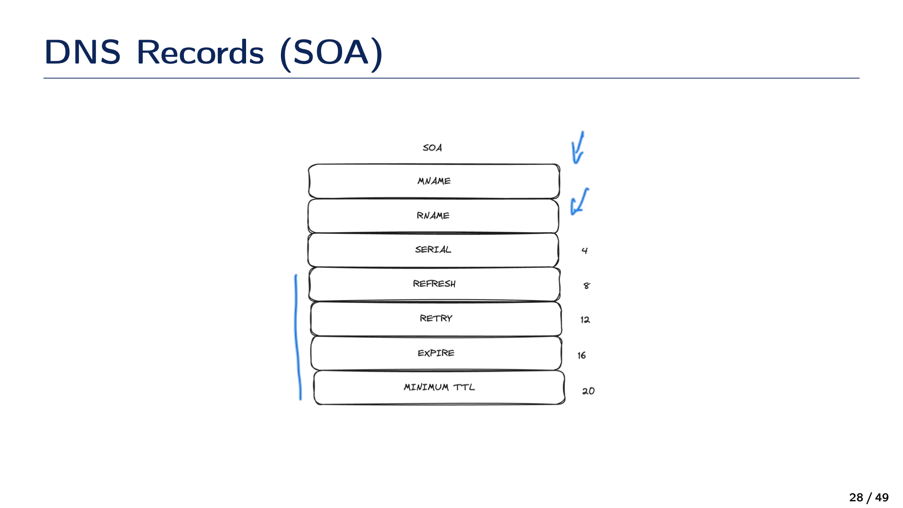
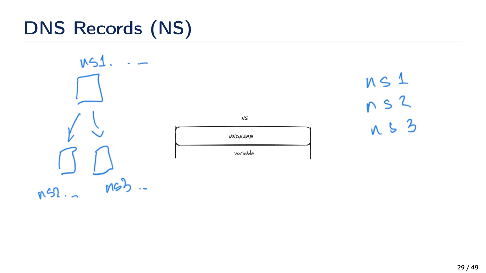
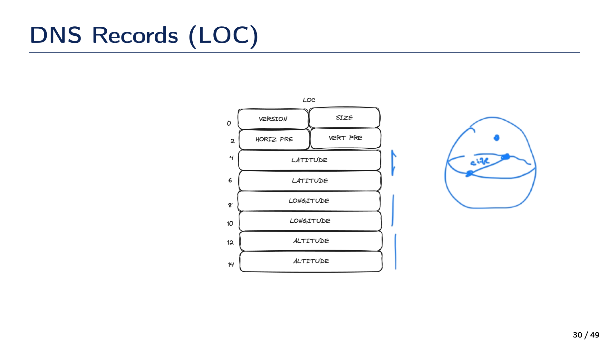

# 43. Опишите типы DNS записей: A, A6, AAAA, CNAME, DNAME, MX, PTR, SOA, NS, LOC, TXT, URI

- A - ipv4
- AAAA - ipv6
- A6 - сжатие ipv6 | prefix len | address suffix | suffix name |
- CNAME, DNAME(*.ya.ru) - aliases (ya.ru = www.ya.ru)
- MX - почта
- PTR - ip $\to$ domain name
- SOA - информация о списке серверов, ответсвенных за домен
  - MName - имя DNS сервера ответвенного за зону
  - RName - адрес администратора
  - Serial - число, которое inc при обновлении
  - Refresh
  - Retry
  - Expire
  - Min TTL
- NS - список DNS серверов, которые отвечают за хранения остальных ресурсах записей домена
- LOC - location
  - version
  - size
  - horizontal precision
  - vertical precision
  - latitude
  - longitude
  - altitude
- TXT - справочная информация, текст
- URI
  - priority (2 bytes)
  - weight (2 bytes)
  - target (ftp со справочной информацией и прочее)

```{dropdown} Доронин, 2024, раздел 5








```{figure} ../images/05_dns/page-31.png
:name:doronin-dns-records
DNS records {cite}`доронин2023-4`
```

```{bibliography}
:style: unsrt
:filter: docname in docnames
```
