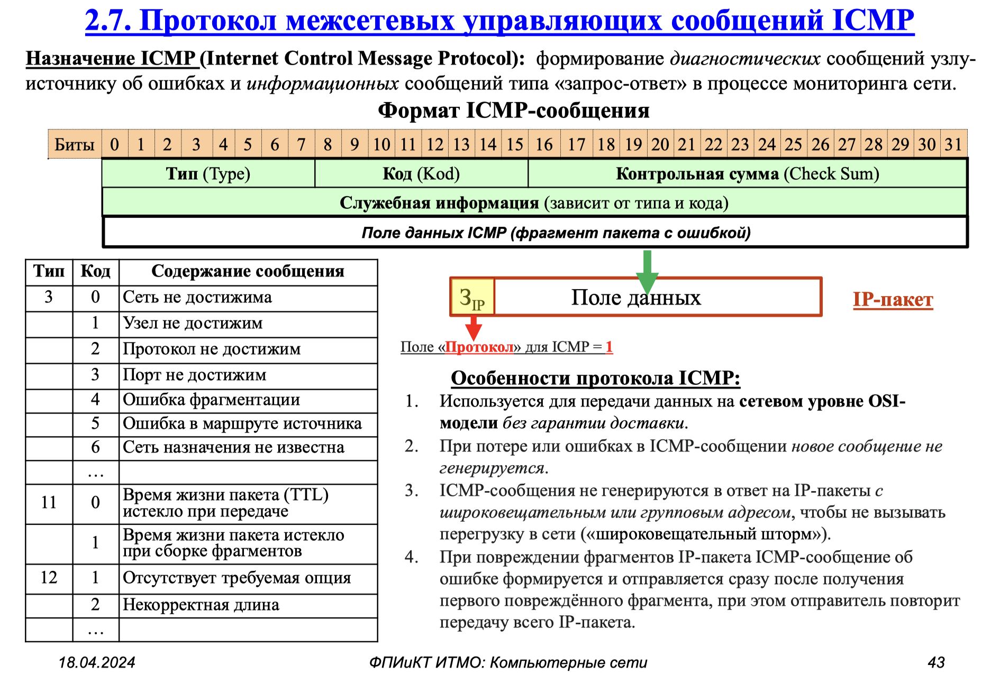
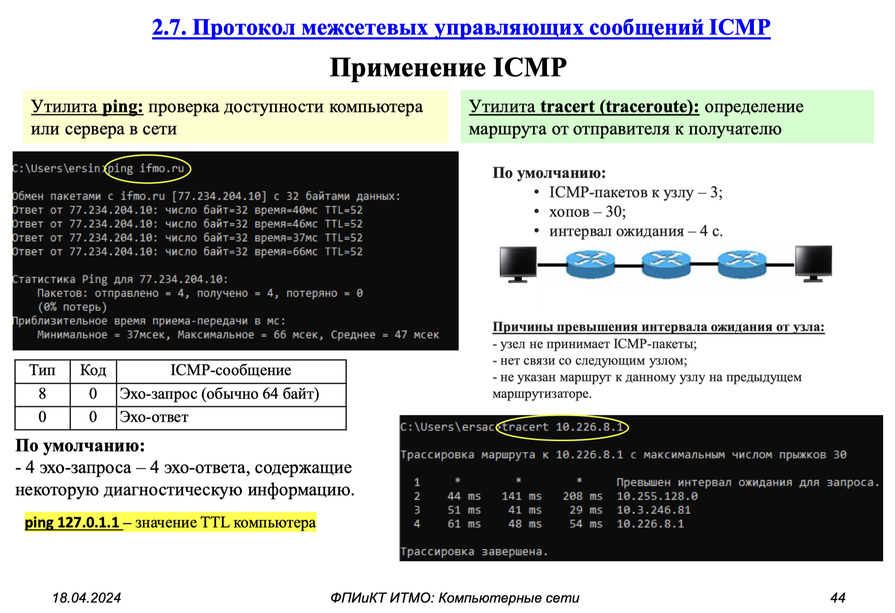

# 5. Опишите с помощью какого протокола детектируются ошибки в сетях

Для обнаружения ошибок в сетях используется протокол ICMP (Internet Control Message Protocol).
```{glossary}
ICMP (Internet Control Message Protocol)
    протокол межсетевых управляющих сообщений, который используется для распространения информации об ошибках передачи данных в сети.
```
## Основные функции ICMP

**Отчеты об ошибках**
- Сообщения об ошибках ICMP информируют о сетевых ошибках, таких как недоступные места назначения, тайм-ауты или проблемы фрагментации.

**Диагностика**
- ICMP используется для диагностики сети (команды `ping` и `traceroute`) (эхо-запросы и эхо-ответы).

**Сетевая безопасность** {cite}`q5-aws-icmp`
- Брандмауэры используют ICMP для разрешения или блокировки определенных типов трафика. 
- Сетевые администраторы также используют инструменты мониторинга ICMP для отслеживания состояния и подключения сетевых устройств, а также обнаружения неизвестных устройств.

## Структура ICMP-пакета
```{figure} ../images/icmp_packet.png
:name: icmp_packet

ICMP message format {cite}`Fulin2021Nov`
```

- Тип сообщения (8 бит)
- Код сообщения (8 бит)
- Контрольная сумма (16 бит)
- Дополнительные данные

**Основные типы сообщений:**
- Echo Request (тип 8) - запрос эха
- Echo Reply (тип 0) - ответ на эхо
- Destination Unreachable (тип 3)
- Time Exceeded (тип 11)
- Redirect (тип 5)

**Пример кодов сообщений:**

Destination Unreachable:

- 0: Network Unreachable
- 1: Host Unreachable
- 3: Port Unreachable
- 4: Fragmentation Needed

Более подробно см. {cite}`Fulin2021Nov`

```{dropdown} Алиев,2024
{cite:p}`алиев2024сети2`


```

```{bibliography}
:style: unsrt
:filter: docname in docnames
```
